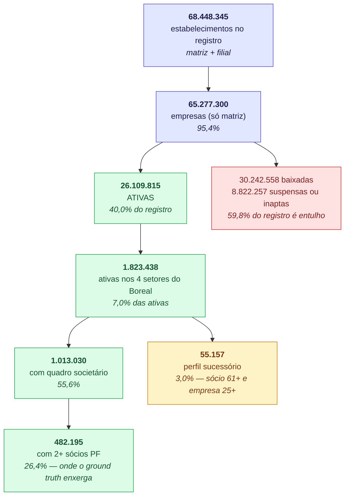
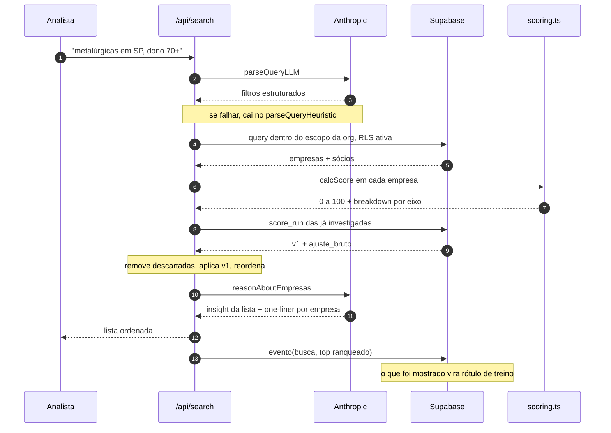
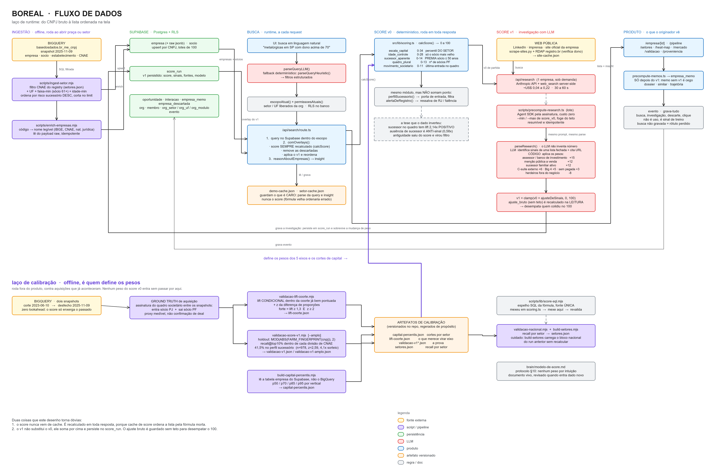
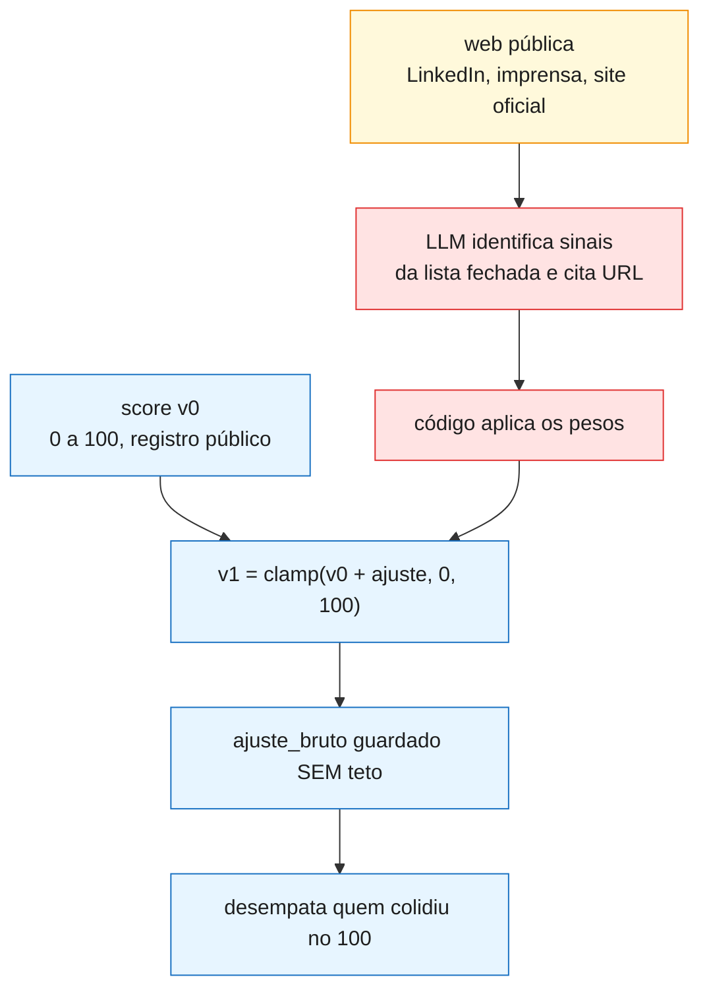
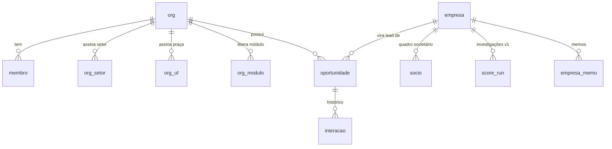
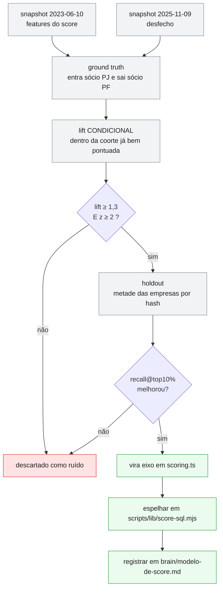

<div align="center">

# Boreal

**Deal sourcing de M&A por risco sucessório.**

Encontra empresas familiares do middle market brasileiro cujo controle tende a mudar de mãos, ordena por probabilidade e diz o porquê de cada nota.

</div>

---

## Índice

1. [O que é isto, sem jargão](#1-o-que-é-isto-sem-jargão)
2. [O problema](#2-o-problema)
3. [A tese, e por que ela mudou](#3-a-tese-e-por-que-ela-mudou)
4. [O universo em números](#4-o-universo-em-números)
5. [Como funciona, em 30 segundos](#5-como-funciona-em-30-segundos)
6. [O mapa completo do fluxo de dados](#6-o-mapa-completo-do-fluxo-de-dados)
7. [As peças, uma por uma](#7-as-peças-uma-por-uma)
8. [Como sabemos que funciona](#8-como-sabemos-que-funciona)
9. [O laço de calibração](#9-o-laço-de-calibração)
10. [Limitações que a gente diz em voz alta](#10-limitações-que-a-gente-diz-em-voz-alta)
11. [Stack](#11-stack)
12. [Rodando local](#12-rodando-local)
13. [Mapa do código](#13-mapa-do-código)
14. [Convenções do repo](#14-convenções-do-repo)

---

## 1. O que é isto, sem jargão

Todo ano, milhares de empresas brasileiras de médio porte trocam de dono. Quem compra essas empresas (fundos, consolidadores, boutiques de M&A) passa semanas garimpando à mão qual delas pode estar aberta a vender. É trabalho de agulha no palheiro: abrir CNPJ um por um, olhar a idade dos sócios, procurar o filho no LinkedIn, ir a feira de setor.

O Boreal faz esse garimpo com o registro público de CNPJ inteiro indexado. Você escreve uma frase, tipo *"metalúrgicas no interior de SP com dono acima de 70 anos"*, e recebe em segundos uma lista de empresas reais, ordenada por **probabilidade de o controle mudar de mãos**, com o motivo de cada posição visível na tela.

A parte que não é óbvia: a ordenação não é palpite. Ela foi calibrada contra **aquisições que realmente aconteceram**, mineradas do próprio registro de CNPJ, e é medida num conjunto de empresas que o modelo nunca viu.

**Em uma frase, para quem é da área:** um motor de originação que usa o quadro societário do CNPJ como sensor de troca de controle, com score de propensão validado por vertical e sem leakage, mais uma camada de investigação por LLM que confirma ou derruba a nota com evidência da web.

---

## 2. O problema

O middle market brasileiro tem um fluxo de sucessão gigante e nenhuma lista boa de quem está perto de vender.

- **Os dados existem e são públicos.** A Receita Federal publica CNPJ, quadro societário, faixa etária dos sócios, capital social, data de entrada de cada sócio na sociedade.
- **Ninguém transforma isso em ordenação.** As bases comerciais vendem a *foto estática*: quem é a empresa hoje. O que decide uma abordagem é o *movimento*: o que mudou no quadro, e quando.
- **O custo do erro de ordem é alto.** Analista bom custa caro e cada abordagem consome relacionamento. Ordenar mal não é só ineficiência, é queimar acesso.

O gargalo não é achar empresa. É saber **com quem falar primeiro**.

---

## 3. A tese, e por que ela mudou

A tese original era a intuitiva, e é a que todo mundo do setor repete:

> Dono velho, sem sucessor à vista, empresa antiga. Essa vende.

Medimos essa intuição contra 239 aquisições reais dentro da coorte que o próprio score já elegia como quente. **Ela está errada no sinal.**

| Sinal no registro | Lift | z | Leitura |
|---|---:|---:|---|
| Capital acima da mediana da coorte | 3,80x | 15,6 | Escala é o que mais prevê |
| Tem sócio PJ no quadro | 3,15x | 5,4 | Movimento institucional já em curso |
| Quadro com 5+ sócios PF | 2,45x | 8,8 | Sociedade plural decide vender melhor |
| Quadro mexeu nos últimos 5 anos | 2,22x | 6,8 | Movimento recente puxa movimento |
| **Tem sócio de até 50 anos** | **2,14x** | **9,5** | **Sucessor presente PREVÊ a venda** |
| Tem filial | 1,97x | 9,9 | Escala, de novo |
| Quadro parado 10+ anos | 0,60x | 8,9 | Empresa parada não transaciona |
| **Não tem sócio de até 50 anos** | **0,58x** | **9,5** | **Ausência de sucessor é ANTI-sinal** |
| 2+ sócios na faixa 80+ | 0,50x | 5,0 | Acumular octogenário piora, não melhora |

> **Lift** é quantas vezes a característica é mais comum entre as empresas adquiridas do que no universo. Lift 2,14x significa: entre as que foram compradas, ter sócio jovem no quadro aparece o dobro do que aparece na população. **z** é quantos desvios-padrão o resultado está de zero. Abaixo de 2 é ruído amostral e não vira eixo do score.

O que o dado diz, e que contraria o senso comum do mercado:

1. **Herdeiro no quadro não trava a venda. Ele é quem a conduz.** O filho de 45 anos que entrou na sociedade é exatamente quem profissionaliza, contrata assessor e negocia. O patriarca de 82 sozinho no quadro, sem ninguém para tocar a transição, é quem morre no cargo com a empresa parada.
2. **Antiguidade da empresa saiu do score.** Era o eixo com o maior lift marginal de todos e mesmo assim foi removido, porque **dentro da coorte já bem pontuada** ela não reordenava nada: era proxy de porte, que o eixo de capital já capturava melhor. Tirá-la **melhorou** o recall em 1,9 ponto. Ela continua no produto, mas como porta de entrada, não como nota.
3. **Empresa parada é anti-sinal.** O que parece "maduro para vender" é, na prática, o perfil de quem não transaciona.

Isto está no código com teste de regressão explícito, para ninguém "consertar" o sinal de volta para a intuição errada:

```ts
test("sucessor aparente PREMIA (lift 2,14x) — é o eixo contraintuitivo", ...)
```

Metodologia completa e protocolo de revisão em [`brain/modelo-de-score.md`](brain/modelo-de-score.md).

---

## 4. O universo em números

Todos os números desta seção saem do snapshot de **2025-11-09** do registro da Receita Federal, e são regerados por [`scripts/stats-universo.mjs`](scripts/stats-universo.mjs), que escreve [`src/lib/stats-universo.json`](src/lib/stats-universo.json). Nada aqui é estimativa.

### Do Brasil inteiro até a lista



**A primeira coisa que o número mostra é que 6 em cada 10 CNPJs do Brasil são lixo para originação.** 30,2 milhões estão baixados e 8,8 milhões suspensos ou inaptos. Qualquer ferramenta que anuncie "60 milhões de empresas" está contando cadáver. O universo real com que se trabalha é 26,1 milhões.

### Metade do universo não tem sócio registrado, e isso não é bug

Dentro dos 4 setores ativos, **44,4% das empresas não têm nenhum sócio no registro**. Antes de tratar isso como falha de ingestão, vale ver a natureza jurídica:

| natureza jurídica | empresas | sem sócio registrado |
|---|---:|---:|
| Sociedade Empresária Limitada | 754.753 | **0,3%** |
| Produtor Rural (Pessoa Física) | 511.215 | **75,4%** |
| Empresário (Individual) | 416.238 | **100%** |
| Sociedade Simples Limitada | 61.979 | 1,3% |

**Não falta dado, falta sócio.** Empresário individual e produtor rural pessoa física não têm quadro societário por definição legal: o dono *é* a pessoa física, e não existe registro de sócio para existir. Onde há sociedade de verdade, a cobertura é de 99,7%.

Mas a consequência para o produto é dura e vale dizer em voz alta: **para 928 mil dessas empresas, o eixo de idade do dono não está incompleto, ele é estruturalmente indisponível.** Não há onde ler a idade do dono no registro público.

E é a mesma população que o ground truth não enxerga (ver a [seção 10](#10-limitações-que-a-gente-diz-em-voz-alta)): empresa de dono único não deixa a assinatura "entra sócio PJ e sai sócio PF" quando é vendida. **O ponto cego dos dados e o ponto cego do label são o mesmo conjunto de empresas**, e é justamente onde a tese sucessória deveria ser mais forte.

### Por setor

| setor | universo ativo | com idade de sócio | % | com 2+ sócios PF | perfil sucessório |
|---|---:|---:|---:|---:|---:|
| Saúde | 778.541 | 662.663 | **85,1%** | 256.534 | 26.566 |
| Agropecuária | 686.325 | 208.896 | **30,4%** | 165.812 | 7.535 |
| Metalmecânica | 293.017 | 85.260 | **29,1%** | 36.918 | 12.003 |
| Educação básica | 65.555 | 56.211 | **85,7%** | 22.931 | 9.053 |

A diferença é enorme e é estrutural, não aleatória. Saúde e educação são sociedades (clínica com dois médicos sócios, escola com mantenedora), então o score enxerga quase tudo. Agro é produtor rural pessoa física e metalmecânica tem muita oficina de dono único, então **o score opera às cegas em cerca de 70% desses dois setores**. Agro é o maior universo dos quatro e é onde o modelo vê menos.

### Preenchimento dos campos

| campo | cobertura nos 4 setores ativos |
|---|---:|
| telefone | **97,7%** |
| e-mail | **83,2%** |
| capital social > 0 | 68,2% |
| quadro societário | 55,6% |
| 2 ou mais sócios PF | 26,4% |

Os campos de **contato são o lado forte da base**, e isso importa mais do que parece: originação morre na hora de falar com a empresa, e 97,7% de telefone significa que a lista é acionável. Já `capital_social` está preenchido em 68,2%, e a [seção 10](#10-limitações-que-a-gente-diz-em-voz-alta) explica por que mesmo o preenchido vale menos do que aparenta.

> Para comparação, a matriz usada na calibração tem **1.465.665** empresas, porque ela é fotografada no corte de **2023-06-10** e não hoje. Os 1.823.438 atuais são 24% a mais em pouco mais de dois anos. Reproduzir com `python scripts/stats-matriz.py`.

---

## 5. Como funciona, em 30 segundos

```mermaid
flowchart LR
    A["O analista escreve<br/>uma frase"] --> B["Boreal traduz<br/>em filtros"]
    B --> C["Busca no registro<br/>de CNPJ indexado"]
    C --> D["Ordena por propensão<br/>a trocar de controle"]
    D --> E["Lista de empresas reais<br/>com o porquê de cada nota"]
    E --> F["Investigar com IA:<br/>a web confirma ou derruba"]
    F --> G["Pipeline, memo<br/>e selo de origem"]

    classDef p fill:#e7f5ff,stroke:#1971c2,color:#1e1e1e
    classDef q fill:#ffe3e3,stroke:#e03131,color:#1e1e1e
    class A,C,D,E,G p
    class B,F q
```



O ciclo de vida de uma requisição, na versão técnica:



---

## 6. O mapa completo do fluxo de dados

Do CNPJ bruto no BigQuery até a lista ordenada na tela, mais o laço de calibração que roda por fora e é o único que muda a fórmula.

[](docs/fluxo-de-dados.png)

*Clique para abrir em tamanho real.* O original editável é [`brain/fluxo-de-dados.excalidraw`](brain/fluxo-de-dados.excalidraw).

> **O desenho é gerado, não desenhado.** [`scripts/gen-fluxo-excalidraw.py`](scripts/gen-fluxo-excalidraw.py) escreve o `.excalidraw` e [`scripts/render-fluxo-png.py`](scripts/render-fluxo-png.py) exporta o PNG que este README embute. Mudou o pipeline, edita a spec no script e roda os dois. Diagrama de arquitetura editado à mão e abandonado vira mentira em duas semanas, e mentira desenhada convence mais que parágrafo desatualizado.

Três coisas que o mapa torna óbvias e o texto não tornava:

1. **O score nunca vem de cache.** É recalculado em toda resposta. Os caches guardam o que é caro (parse da query, insight do LLM), nunca a nota, porque cache de score ordena a lista pela fórmula morta.
2. **O v1 não substitui o v0.** Ele soma por cima, persiste em `score_run` e volta como overlay na próxima busca.
3. **A calibração é a única entrada de peso no score.** É a seta roxa subindo, e ela vem de fora do produto.

---

## 7. As peças, uma por uma

### 7.1. Ingestão (offline)

Roda quando se abre uma praça ou um setor novo, não a cada request.

`scripts/ingest-setor.mjs` consulta o dataset `br_me_cnpj` da Base dos Dados no BigQuery, filtra por CNAE (do registry em `src/lib/setores.json`), UF, faixa etária mínima do sócio mais velho e idade mínima da empresa, ordena por risco sucessório decrescente e corta no limite. Depois grava no Supabase com upsert idempotente por CNPJ, em lotes de 100.

```bash
node --env-file=.env.local scripts/ingest-setor.mjs saude --uf=MG --limit=3000
node --env-file=.env.local scripts/ingest-setor.mjs educacao --faixa-min=7 --limit=20000
node --env-file=.env.local scripts/ingest-setor.mjs --cnae=41,42,43 --rotulo="construção" --uf=BR
```

O `--faixa-min` existe por um motivo específico: cortar só por `--limit` ordenado por faixa etária gera um recorte que depende do tamanho do setor. Num setor grande a base ficava 100% em faixa 8 e 9 (71+ anos), sem nenhuma empresa em faixa 7 (61 a 70), e o eixo de idade do score virava quase constante. Com o filtro explícito o recorte é o mesmo em qualquer setor.

`scripts/enrich-empresas.mjs` resolve código para nome legível (município via IBGE, descrição de CNAE, natureza jurídica) lendo do payload `raw` guardado no upsert, então é idempotente e nada se perde.

### 7.2. Score v0: o registro público, determinístico

[`src/lib/scoring.ts`](src/lib/scoring.ts). Roda em toda resposta, custa microssegundos, cinco eixos somando exatamente 100.

| Eixo | Pontos | O que mede | Por que assim |
|---|---:|---|---|
| `escala_capital` | 0 a 34 | Percentil de capital social **dentro do setor** | Capital é nominal e a escala muda por setor. Comparar metalúrgica com clínica pelo valor bruto vira ranking de setor rico contra setor pobre. |
| `idade_controle` | 0 a 28 | Faixa etária do sócio **mais velho**, só ele | Acumular octogenário não acumula ponto: 2+ na faixa 80+ tem lift 0,50x. |
| `sucessor_aparente` | 0 a 14 | Existe sócio de até 50 anos no quadro | O eixo contraintuitivo. **Premia** a presença, lift 2,14x. |
| `quadro_plural` | 0 a 13 | Número de sócios pessoa física | 5+ sócios PF tem lift 2,45x. |
| `movimento_societario` | 0 a 11 | Quão recente é a última entrada no quadro | Movimento recente puxa movimento. Quadro parado 10+ anos tem lift 0,60x. |

Duas funções vivem no mesmo módulo e **não somam ponto**:

- **`perfilSucessorio()`** é a porta de entrada da tese: sócio 61+ **e** empresa com 25+ anos. É aqui que a antiguidade passou a morar depois de sair do score. Filtra, não ordena.
- **`alertaDeRegistro()`** detecta marcador de distress na razão social (recuperação judicial, liquidação, massa falida, intervenção) e vira a primeira ressalva exibida. Não mexe na nota. São 133 empresas na base inteira, 32 delas com score acima de 70, que antes apareciam no topo da lista sem nenhuma sinalização.

Os cortes de percentil vivem em `src/lib/capital-percentis.json`, gerados a partir da **própria base indexada** e não do BigQuery, porque quem é rankeado são as empresas do Supabase. Consequência aceita: crescer o ingest desloca os cortes e reordena a lista, então o arquivo é versionado e regerado de propósito, nunca calculado em runtime.

### 7.3. Busca (runtime)

[`src/app/api/search/route.ts`](src/app/api/search/route.ts).

1. A frase vira filtro estruturado via `parseQueryLLM()`, com `parseQueryHeuristic()` como fallback determinístico se o LLM falhar.
2. `escopoAtual()` e `permissoesAtuais()` limitam a busca ao setor e à UF que a firma assinou. A RLS do Postgres é a segunda barreira, não a única.
3. `comOverlays()` recalcula o score de toda resposta (inclusive as vindas de cache), remove as empresas descartadas no radar, aplica o overlay do v1 e reordena.
4. `reasonAboutEmpresas()` gera o insight da lista e o one-liner de cada empresa.

### 7.4. Score v1: a investigação com LLM

[`src/lib/research.ts`](src/lib/research.ts). Híbrido e honesto, com a divisão de trabalho explícita:

- **O LLM identifica** quais sinais existem, de uma **lista fechada**, e cita a URL da fonte.
- **O código aplica os pesos.** O modelo nunca inventa número de score.
- O ajuste é **bidirecional**: pode subir ou rebaixar o risco.



| Sinal | Peso |
|---|---:|
| Assessor ou banco de investimento contratado | +15 |
| Menção pública a sucessão ou venda | +12 |
| Sucessor familiar já atuando | +12 |
| C-suite profissional externo à família | +6 |
| Auditoria Big 4 | +5 |
| Sem pegada digital (perfil old-school) | +3 |
| Herdeiros fora do negócio | −8 |

> **Honestidade sobre estes pesos:** diferente dos eixos do v0, eles **não** saíram de lift medido contra aquisições reais, e não teriam como sair (medir exigiria rodar o LLM sobre centenas de milhares de empresas). São calibrados por ancoragem. Onde existe um proxy de registro medível, a **direção** deles é obrigada a concordar com o dado. Foi assim que dois apareceram invertidos em 29/07/2026: `sucessor_familiar_ativo` valia −25, o maior castigo do sistema, e `herdeiro_fora_carreira` valia +8. Os dois trocaram de lado. Os outros cinco continuam sem validação, e isso está registrado em [`brain/pending.md`](brain/pending.md).

**Duas portas de entrada** para a mesma investigação, compartilhando prompt e parse:

| | `/api/research` | `scripts/precompute-research.ts` |
|---|---|---|
| Quando | Sob demanda, 1 empresa | Lote, offline |
| Motor | Anthropic API + web search server-side | Agent SDK pela assinatura |
| Custo | US$ 0,04 a 0,22 por empresa | Zero (orçamento de sessão) |
| Faixa de score | Sem controle | `--min` / `--max` |
| Resumível | N/A | Sim, idempotente, grava a cada empresa |

O `ajuste_bruto` existe porque o score satura em 100 e a evidência não. Ajustes de +12 a +30 viravam todos o mesmo +3 no teto, e seis níveis diferentes de evidência ficavam visualmente idênticos. Ele é recalculado **na leitura**, a partir da lista de sinais crua, então sobrevive a mudança de peso.

### 7.5. O produto

| Rota | O que faz |
|---|---|
| `/` | Busca em linguagem natural, superfície de triagem |
| `/empresa/[id]` | Ficha completa: breakdown do score, sinais, sócios, memo, similares, trajetória |
| `/pipeline` | Kanban de originação: `identificado` → `abordado` → `em_conversa` → `qualificado` → `entregue` → `arquivado` |
| `/setores` | Cobertura e recall validado por setor |
| `/heat-map` | Treemap de atividade de M&A observada por divisão CNAE e região |
| `/mercado` · `/consolidadores` | Quem está comprando no setor |
| `/validacao` | A prova aberta: metodologia e números |
| `/proveniencia/[id]` | Selo de origem do lead |
| `/descartadas` · `/agenda` · `/metricas` | Radar de descarte, agenda e uso |

**Proveniência** é um HMAC-SHA256 sobre `(cnpj | data_origem | score)` com o segredo do servidor. Só o Boreal emite um selo válido, então ele prova origem e data, e o parceiro não consegue forjar nem retroagir. É o que destrava o success fee sem discussão.

### 7.6. Acesso e multi-tenant

Não existe auto-cadastro. Entra quem foi convidado por `scripts/convidar.ts`, que cria o usuário no Supabase Auth e a linha em `membro` na mesma operação, de forma idempotente. O login é por magic link em `/acesso`. A middleware renova a sessão e barra quem não está autenticado, mas não checa vínculo com firma, porque isso custaria uma query por request: quem recusa é `escopoAtual()`.



`empresa`, `socio` e `score_run` são **corpus compartilhado**, derivado de registro público. O que é por firma são `oportunidade`, `interacao`, `empresa_memo`, `empresa_descartada` e os entitlements.

### 7.7. `evento`: o sensor do laço de aprendizado

O que se grava em `evento` não é uso, é **sinal de treino**. O v0 é heurística e o v1 soma sinais da web; nenhum dos dois aprende sozinho. Quem ensina é a revelação de preferência do analista: a lista que mostramos contra o que ele salvou e o que descartou. Salvar o 17º e ignorar o 1º é o score errando, com rótulo de graça.

Por isso `registrarBusca` guarda **o top ranqueado**, não só a query. Diferente de quase tudo neste repo, isto não é recomputável: busca não gravada é rótulo perdido para sempre. E gravar evento nunca pode derrubar a request do usuário, então toda falha ali vira `console.error` e a vida segue.

---

## 8. Como sabemos que funciona

### O ground truth sai de graça do próprio CNPJ

Ninguém precisa comprar base de M&A. Comparando dois snapshots do registro de CNPJ, a assinatura de uma aquisição aparece sozinha: **entra um sócio pessoa jurídica e sai um sócio pessoa física**.

- Snapshot de corte, **2023-06-10**: todas as features do score são lidas aqui.
- Snapshot de desfecho, **2025-11-09**: as aquisições são detectadas aqui.
- **Zero lookahead.** O score nunca enxerga informação posterior ao corte.

É proxy, não confirmação de deal. A limitação está na seção 10.

### Holdout, não ajuste na própria amostra

As empresas são divididas em duas metades por `MOD(ABS(FARM_FINGERPRINT(cnpj_basico)), 2)`, um hash determinístico e não um sorteio, então a divisão é reprodutível entre execuções. A fórmula é escolhida numa metade e o número reportado sai **só da outra**.

### A métrica: recall no top 10%

De todas as aquisições reais, que fatia o score colocou no **decil mais alto** dentro do próprio setor? Sorteio acerta 10% por definição. Tudo acima disso é o valor do score.

| Recorte | n | score v0 | score v1 | vs. sorteio |
|---|---:|---:|---:|---:|
| Universo nacional | 7.060 | 47,2% | **60,6%** | 6,1x |
| Perfil sucessório (a tese) | 978 | 35,8% | **41,5%** | 4,1x |

O ganho no perfil sucessório é de 5,7 pontos com **z = 2,59**, medido em holdout com n seis vezes maior que a primeira medição.

> ⚠️ **Estes números estão em revisão desde 02/08/2026, e para baixo.** A calibração descobriu que o label de aquisição não consegue classificar empresa de sócio único: são 292.499 empresas com 1 sócio PF e **zero** aquisições detectadas, porque a assinatura "entra PJ e sai PF" exige que sobre alguém no quadro. Essas empresas estavam no denominador, nunca podiam contar como acerto perdido e ainda liberavam vaga no decil de cima. Medindo só onde o label consegue classificar, o recall do perfil sucessório cai de **42,0% para 36,9%**. O método já foi trocado (universo elegível + métrica estratificada por nº de sócios) e está documentado em [`brain/modelo-de-score.md`](brain/modelo-de-score.md) §13; a renumeração de todas as tabelas desta seção acontece quando os pesos recalibrados forem aplicados. Até lá, **o número honesto para citar é 36,9%**, e não o 41,5% da tabela acima.

### Por setor

Recall no perfil sucessório, base nacional, janela 2023-06 a 2025-11:

| Setor | CNAE | Universo | Aquisições no perfil | Recall |
|---|---|---:|---:|---:|
| Agro | 01, 02, 03 | 618.787 | 83 | **95%** |
| Metalmecânica | 24, 25, 28 | 250.845 | 77 | **90%** |
| Saúde | 86 | 531.119 | 133 | **77%** |
| Educação | 851, 852 | 64.914 | 24 | **63%** |

**N total = 317.** Números anteriores a 30/07/2026 citavam 97% a 100% e estavam **inflados por construção da métrica**, não só desatualizados: o recorte filtrava por sócio 61+ e empresa 25+, que eram exatamente os dois campos onde o v0 concentrava 60 dos seus 100 pontos. Não era teste justo do score. Foi corrigido em todo o material de cliente.

### Saturação: o efeito colateral que a v1 resolveu

Antes, 226 metalúrgicas empatavam em score 100 na base de produção. "Top 10" não queria dizer nada, era um sorteio dentro de um platô. Depois da recalibração são **11**, e o topo virou gradiente real: 100, 97, 95, 94, 93, 92, 91, 90, 89, 88.

### Reprodução completa

```bash
node --env-file=.env.local scripts/validacao-lift-coorte.mjs       # lift condicional + z
node --env-file=.env.local scripts/validacao-score-v1.mjs --amplo  # holdout, recall@top10%
node --env-file=.env.local scripts/build-capital-percentis.mjs     # cortes por vertical
node --env-file=.env.local scripts/validacao-nacional.mjs          # recall por setor
node --env-file=.env.local scripts/build-setores.mjs               # registry de setores
npm test                                                            # testes do score
```

---

## 9. O laço de calibração

Nenhum peso entra no score por intuição. O caminho é fechado e tem gate em dois pontos:



O **lift condicional** é a peça que separa este processo de uma medição ingênua. Lift marginal, medido contra o universo inteiro, responde "esta característica aparece mais nas adquiridas?". Lift condicional responde a pergunta que importa: "**dentro da coorte que o score já elegeu**, sobra sinal que ele ainda não olha?". Característica que é só proxy de um eixo existente tem lift marginal alto e perde tudo aqui. Foi assim que a antiguidade da empresa, o eixo de maior lift marginal de todos, foi removida.

O passo do `score-sql.mjs` não é burocracia. Existiam cópias independentes da fórmula em SQL espalhadas por vários scripts de validação, e elas divergiram do TypeScript sem ninguém notar: `build-setores.mjs` chegou a publicar um arquivo misturando score v0 (bloco nacional) com v1 (bloco SP) sob um timestamp novo que mascarava a inconsistência. Hoje a fórmula em SQL mora num lugar só.

---

## 10. Limitações que a gente diz em voz alta

- **O ground truth é proxy, e é cego justamente no caso central.** "Entra sócio PJ e sai sócio PF" captura troca de controle registrada, não deal confirmado. Pega reorganização de holding familiar junto, e perde aquisição feita por pessoa física ou estruturada fora do quadro societário. Pior: ele **só enxerga aquisição parcial**. Empresa de sócio único é estruturalmente inclassificável (sair de 1 sócio PF para 0 acontece 1 vez em 292 mil no registro), e é exatamente o perfil que a tese de sucessão mais quer prever. Consequência medida em 02/08/2026: o eixo de idade do dono tem lift 1,00x dentro de faixas de nº de sócios, o que **não** quer dizer que idade não prevê venda, e sim que este label não consegue testar idade. Ver [`brain/modelo-de-score.md`](brain/modelo-de-score.md) §13.
- **Faixa etária é faixa, não idade.** A Receita publica banda (61 a 70, 71 a 80, 80+), não a data de nascimento. O eixo de idade é mais grosso do que parece.
- **Capital social não é faturamento, e é um número congelado.** Ele é declarado na constituição da empresa e quase nunca atualizado: medido em 11/08/2026, o valor é **idêntico entre os snapshots de 2023 e 2025 em 96,8%** das empresas dos 4 setores. Mesmo assim é o eixo mais forte do score, o que diz mais sobre a pobreza do registro público do que sobre a qualidade do campo. O `porte` da Receita entrou como segundo eixo de tamanho em 11/08 e é ainda mais estático (99,0% idêntico), então ele agrega por medir outra coisa, faixa de receita, e não por ser mais fresco. O produto **nunca** fabrica EBITDA ou receita. Ver [`brain/modelo-de-score.md`](brain/modelo-de-score.md) §14.
- **Metade do universo não tem sócio, e não há como consertar.** Empresário individual e produtor rural pessoa física não têm quadro societário por definição legal, e são 928 mil empresas nos 4 setores. Para elas o eixo de idade do dono é **estruturalmente indisponível**, não incompleto. É a mesma população que o ground truth não enxerga. Números na [seção 4](#4-o-universo-em-números).
- **A lista tem empate na fronteira.** O score é uma soma de poucos inteiros, então tem cerca de 60 valores distintos para 200 mil empresas, e o corte do top 10% cai dentro de um bloco de empates. Medido: **4,1% das vagas do top 10% são preenchidas por desempate arbitrário** com os pesos de hoje. Consequência prática: o recall citado carrega ±0,25 ponto de ruído no agregado e **±0,91 no recorte do perfil sucessório**, que é justamente o número mais citado. Uma casa decimal ali é precisão falsa.
- **Cinco dos sete pesos do v1 nunca foram validados** contra lift medido.
- **A validação existe em quatro setores.** Fora de metalmecânica, saúde, educação e agro, o score roda, mas sem recall medido. O heat-map marca explicitamente quais divisões são validadas.
- **29% da faixa de score 90+ já tem sócio PJ no quadro.** Pode ser holding familiar, pode ser venda parcial já ocorrida, pode ser sócio institucional. É decisão de tese em aberto, não bug.
- **O recorte de agro exigiu `--idade-min`.** A formalização em massa de produtor rural entre 2006 e 2010 faz a data de abertura do CNPJ não dizer a idade do negócio naquela coorte.

O que está aberto agora fica em [`brain/pending.md`](brain/pending.md), sempre.

---

## 11. Stack

| Camada | Escolha |
|---|---|
| App | Next.js 16 (App Router, Turbopack), React 19, TypeScript, Tailwind v4 |
| UI | shadcn + Base UI, dnd-kit no pipeline, lucide |
| Banco | Supabase (Postgres) com RLS, Supabase Auth por magic link |
| Data warehouse | BigQuery, dataset `br_me_cnpj` da Base dos Dados |
| LLM | Anthropic API (parser de query, reasoner, research, memo) + Agent SDK nos lotes offline |
| Testes | Runner nativo do Node (`node --test --experimental-strip-types`) |
| Scraping | Scrapling (Python), com verificação de domínio via RDAP do registro.br |

Sobre a verificação de domínio: o reverso CNPJ para domínio não é público, mas a titularidade do `.br` é. O pipeline acha domínios candidatos via buscador, filtra agregadores e depois **confirma pelo RDAP** se o CNPJ do titular bate com o da empresa. É o que transforma "chute do buscador" em site oficial confirmado.

---

## 12. Rodando local

```bash
npm install
cp .env.example .env.local     # preencher Supabase, Anthropic e GCP/BigQuery
# aplicar as migrations de supabase/migrations/ no seu projeto Supabase
npm run dev                    # http://localhost:3000
```

```bash
npm test                       # testes do score e do research
npm run lint
npm run build
```

Para entrar você precisa de convite, porque não há auto-cadastro:

```bash
node --experimental-strip-types --env-file=.env.local scripts/convidar.ts \
  --email=voce@firma.com --nome="Seu Nome" --org=setter
```

Depois é magic link em `/acesso`.

Regenerar os diagramas deste README:

```bash
python scripts/gen-fluxo-excalidraw.py && python scripts/render-fluxo-png.py
```

---

## 13. Mapa do código

| Caminho | O quê |
|---|---|
| `src/app/` | Páginas e rotas de API |
| `src/lib/scoring.ts` | **O score v0.** IP determinístico. Testes em `scoring.test.ts` |
| `src/lib/capital-percentis.json` | Cortes de capital por vertical, artefato versionado |
| `src/lib/research.ts` · `research-store.ts` | Score v1: prompt, pesos, persistência e overlay |
| `src/lib/dossier.ts` · `memo-store.ts` | Memo e dossiê |
| `src/lib/escopo.ts` · `permissoes.ts` | Multi-tenant: escopo da firma e entitlements |
| `src/lib/evento.ts` | Sensor do laço de aprendizado |
| `src/lib/proveniencia.ts` | Selo HMAC de origem do lead |
| `src/lib/heatmap.ts` · `treemap.ts` | Atividade de M&A por setor e região |
| `scripts/ingest-*.mjs` | Ingestão do BigQuery para o Supabase |
| `scripts/validacao-*.mjs` | Medição: lift, holdout, recall |
| `scripts/stats-universo.mjs` · `stats-matriz.py` | **Os números da seção 4.** Funil do universo e saúde da base |
| `scripts/extrai-matriz-score.mjs` | Extrai a matriz de calibração do BigQuery, uma vez |
| `scripts/calibra-score.py` | **O laço de calibração.** Busca no dev, `--ruido`, `--holdout` |
| `scripts/diagnostico-*.py` | Contaminação do label e lift condicional dos eixos candidatos |
| `scripts/check-vazamento-simples.mjs` | Prova de por que a flag do Simples não pode ser feature |
| `scripts/check-estagnacao-campos.mjs` | Quanto `capital_social` e `porte` ficam congelados |
| `scripts/lib/score-sql.mjs` | **Espelho SQL da fórmula, fonte única.** Mexeu em `scoring.ts`, mexe aqui |
| `scripts/precompute-*.ts` | Lotes offline de investigação e memo |
| `supabase/migrations/` | Schema do Postgres |
| `brain/` | Memória do projeto: metodologia, decisões, pendências, progresso |
| `docs/` | Imagens geradas que o README embute |

### Onde ler primeiro

| Se você quer entender... | Leia |
|---|---|
| Como o score é construído, medido e revisado | [`brain/modelo-de-score.md`](brain/modelo-de-score.md) |
| O que está em aberto agora | [`brain/pending.md`](brain/pending.md) |
| Por que uma decisão foi tomada | [`brain/decisions.md`](brain/decisions.md) |
| O que aconteceu em cada sessão | [`brain/progress.md`](brain/progress.md) |
| Como operar no repo, agentes inclusive | [`CLAUDE.md`](CLAUDE.md) |

---

## 14. Convenções do repo

- **Domínio em português, código em inglês.** Os dados são brasileiros e traduzir `empresa`, `socio`, `junta_comercial` só cria distância entre o schema e a fonte. Variáveis de infraestrutura, commits e comentários técnicos ficam em inglês.
- **Nenhum peso de score por intuição.** O protocolo está em `brain/modelo-de-score.md` §10 e vale para os dois lados: adicionar e remover eixo.
- **Mexeu em `scoring.ts`?** Mexe também em `scripts/lib/score-sql.mjs` e roda `scripts/validacao-score-v1.mjs`. As duas cópias da fórmula divergirem em silêncio já aconteceu.
- **Nunca fabricar métrica financeira.** Porte e capital social são os únicos sinais honestos de tamanho que o registro público oferece.
- **Artefato de prova documenta a versão viva.** Material de cliente que cita número de uma fórmula aposentada é pior que material nenhum.
- **`brain/` é atualizado junto com o código, não no fim do mês.** Documento desatualizado não fica neutro, ele mente ativamente.
